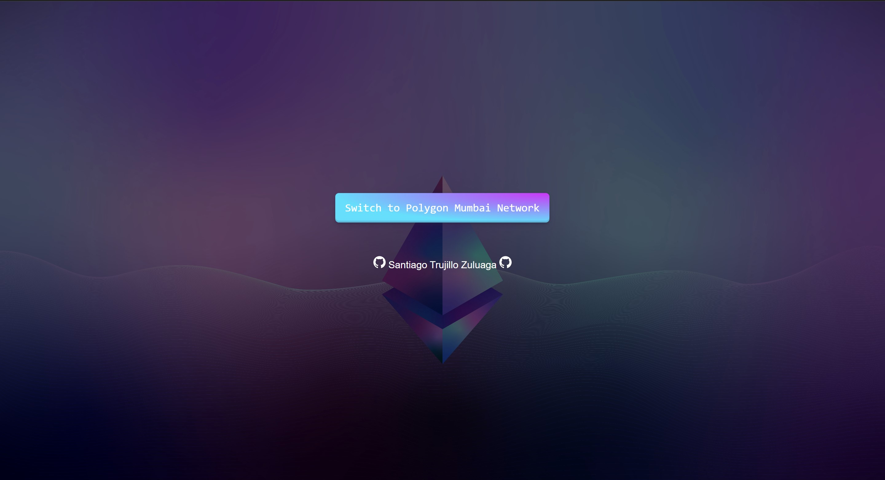

# ♾️ METANA WEEK 3 ♾️
Assignment:
You must have a total of 7 tokens within the collection id [0-6]
There is no supply limit for each token
Anyone can mint tokens [0-2], but there is a 1-minute cooldown between mints. These are free to mint except for the gas cost.
Token 3 can be minted by burning token 0 and 1.
Token 4 can be minted by burning token 1 and 2
Token 5 can be minted by burning 0 and 2
Token 6 can be minted by burning 0, 1, and 2
Tokens [4-6] cannot be forged into other tokens
Tokens [4-6] can be burned but you get nothing back
You can trade any token for [0-2] by hitting the trade this button.
The process of burning and minting is called forging in this context.
The webapp must tell the user how much matic they have (we will use the polygon network for cost savings)
The webapp must tell the user how much of each token they have
Provide a link to the OpenSea page somewhere
Important if the website detects someone is not on the polygon network, it must prompt them to change and autofill the feeds for changing the network (lesson on this later)
Important please use some styling on this website to make it look nice (bootstrap, tailwind CSS, etc). This is something you can show to future employers or business partners.
You must use 2 separate contracts. One for the ERC1155 token, and one for the forging logic. The forging logic will need mint privileges.
Warning: Start on this assignment early. The solidity code is easy to write, but the frontend integration and workflows will have a lot of unfamiliar problems we will not explicitly teach you about. It is inevitable that you will encounter them in this assignment, so start early!
# Contract MultiTokem (ERC1155)
```0x8EDF94B03e15171bab5C6DBDa4Efb1C57263Ed96```

# Contract Forging 
```0xFfb1F858c947e5120c3e2855d73d95B341809d58```

# Deployed dApp
```https://super-shadow-2050.on.fleek.co/```

